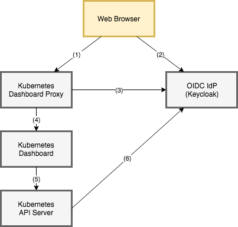

# Kubernetes Dashboard Proxy [](https://circleci.com/gh/int128/kubernetes-dashboard-proxy)

A Helm chart with [keycloak-proxy](https://github.com/gambol99/keycloak-proxy) to protect the Kubernetes Dashboard with OpenID Connect (OIDC) authentication.




## TL;DR

You can install the charts as follows:

```sh
# Kubernetes Dashboard
helm install stable/kubernetes-dashboard --namespace kube-system --name kubernetes-dashboard

# Kubernetes Dashboard Proxy
helm repo add int128.github.io https://int128.github.io/helm-charts
helm repo update
helm install int128.github.io/kubernetes-dashboard-proxy --namespace kube-system --name kubernetes-dashboard-proxy -f kubernetes-dashboard-proxy.yaml
```

See also [this article](https://medium.com/@int128/protect-kubernetes-dashboard-with-openid-connect-104b9e75e39c).


## Getting Started with Keycloak

### 1. Setup Keycloak

Create an OIDC client as follows:

- Redirect URL: `https://kubernetes-dashboard.example.com/oauth/callback`
- Issuer URL: `https://keycloak.example.com/auth/realms/YOUR_REALM`
- Client ID: `kubernetes`
- Groups claim: `groups`

Then create a group `kubernetes:admin` and join to it.

### 2. Setup Kubernetes API Server

Setup the Kubernetes API Server accepts an OIDC ID token.

If you are using kops, `kops edit cluster` and append the following spec:

```yaml
spec:
  kubeAPIServer:
    oidcIssuerURL: https://keycloak.example.com/auth/realms/YOUR_REALM
    oidcClientID: kubernetes
    oidcGroupsClaim: groups
```

### 3. Install the charts

This repository has [helmfile.yaml](helmfile.yaml) for the following charts:

- Kubernetes Dashboard Proxy
- [Kubernetes Dashboard](https://github.com/kubernetes/charts/tree/master/stable/kubernetes-dashboard)
- [Heapster](https://github.com/kubernetes/charts/tree/master/stable/heapster)

Install [Helmfile](https://github.com/roboll/helmfile) and run it:

```sh
export KUBE_DASHBOARD_DOMAIN=kubernetes-dashboard.example.com
export KUBE_OIDC_DISCOVERY_URL=https://keycloak.example.com/auth/realms/YOUR_REALM
export KUBE_OIDC_CLIENT_ID=kubernetes
export KUBE_OIDC_CLIENT_SECRET=YOUR_SECRET

helmfile sync
```


### 4. Assign a role

Open `https://kubernetes-dashboard.example.com`.

At this time, an `Unauthorized` error may appear on the dashboard because you have no role.
Here assign the `cluster-admin` role to the current group.

```yaml
kind: ClusterRoleBinding
apiVersion: rbac.authorization.k8s.io/v1
metadata:
  name: keycloak-admin-group
roleRef:
  apiGroup: rbac.authorization.k8s.io
  kind: ClusterRole
  # NOTE: This is a super administrator and can do everything.
  # Consider a dedicated role in your actual operation.
  name: cluster-admin
subjects:
- kind: Group
  name: /kubernetes:admin
```

Now all objects should appear in the dashboard.


## Getting Started with Google Account

### 1. Setup Google API

Open [Google APIs Console](https://console.developers.google.com/apis/credentials) and create an OAuth client as follows:

- Application Type: Web application
- Redirect URL: `https://kubernetes-dashboard.example.com/oauth/callback`

### 2. Setup Kubernetes API Server

Setup the Kubernetes API Server accepts an OIDC ID token.

If you are using kops, `kops edit cluster` and append the following settings:

```yaml
spec:
  kubeAPIServer:
    oidcIssuerURL: https://accounts.google.com
    oidcClientID: xxx-xxx.apps.googleusercontent.com
```

### 3. Install the charts

This repository has [helmfile.yaml](helmfile.yaml) for the following charts:

- Kubernetes Dashboard Proxy
- [Kubernetes Dashboard](https://github.com/kubernetes/charts/tree/master/stable/kubernetes-dashboard)
- [Heapster](https://github.com/kubernetes/charts/tree/master/stable/heapster)

Install [Helmfile](https://github.com/roboll/helmfile) and run it:

```sh
export KUBE_OIDC_DISCOVERY_URL=https://accounts.google.com
export KUBE_OIDC_CLIENT_ID=xxx-xxx.apps.googleusercontent.com
export KUBE_OIDC_CLIENT_SECRET=Mx3xL96Ixn7j4ddWOCH1l8VkB6fiXDBW

helmfile sync
```

### 4. Assign a role

Open `https://kubernetes-dashboard.example.com`.

At this time, an `Unauthorized` error may appear on the dashboard because you have no role.
Here assign the `cluster-admin` role to yourself.

```yaml
kind: ClusterRoleBinding
apiVersion: rbac.authorization.k8s.io/v1
metadata:
  name: keycloak-admin-group
roleRef:
  apiGroup: rbac.authorization.k8s.io
  kind: ClusterRole
  # NOTE: This is a super administrator and can do everything.
  # Consider a dedicated role in your actual operation.
  name: cluster-admin
subjects:
- kind: User
  name: https://accounts.google.com#1234567890
```

Now all objects should appear in the dashboard.


## Configuration

You can set the following values for the Kubernetes Dashboard Proxy.

Parameter | Description | Default
----------|-------------|--------
`proxy.oidc.discoveryURL` | Discovery URL. | (mandatory)
`proxy.oidc.clientID` | Client ID. | (mandatory)
`proxy.oidc.clientSecret` | Client secret. | (mandatory)
`proxy.oidc.redirectURL` | Redirect URL. This may be same to the external URL in most cases. | (mandatory)
`proxy.cookieEncryptionKey` | Encryption key to store a session to a browser cookie. This should be 16 or 32 bytes string. | 32 bytes random string
`proxy.upstreamURL` | Kubernetes Dashboard service URL. | `https://kubernetes-dashboard.kube-system.svc.cluster.local`.
`proxy.enableAuthorizationHeader` | Add the authorization header to the proxy request. | `true`
`proxy.enableAuthorizationCookies` | Add the authorization cookies to the uptream proxy request. | `false`
`ingress.enabled` | Enable ingress controller resource. | `false`
`ingress.hosts` | Hostnames | `[]`
`resources.limits` | Pod resource limits. | `{}`
`resources.requests` | Pod resource requests. | `{}`

See also [kubernetes-dashboard-proxy.yaml](kubernetes-dashboard-proxy.yaml).

### nginx ingress controller

If you are using [nginx-ingress](https://github.com/kubernetes/ingress-nginx), make sure `proxy_buffer_size` option is larger than 4kB.
You can set it in the ConfigMap of nginx-ingress.

```yaml
    proxy-buffer-size: "64k"
```


## Special thanks

This depends on [gambol99/keycloak-proxy](https://github.com/gambol99/keycloak-proxy).
Thank you for the great work.


## Contributions

This is an open source software licensed under Apache License 2.0.
Feel free to open issues or pull requests.
